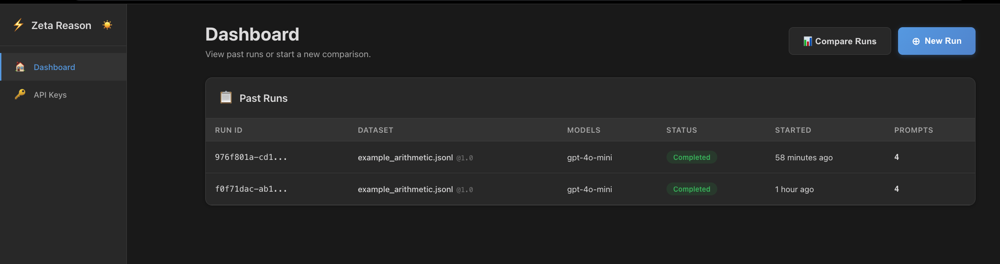

# Zeta Reason

> Chain-of-Thought Reasoning Benchmarking for Large Language Models

[](https://github.com/yourusername/zeta-reason)
[](https://www.python.org/downloads/)
[](https://www.typescriptlang.org/)
[](LICENSE)

Zeta Reason is a comprehensive benchmarking platform for evaluating chain-of-thought (CoT) reasoning capabilities in large language models. It provides detailed metrics, comparative analysis, and an intuitive interface for researchers and developers.



## ✨ Features

### Core Capabilities
- **Multi-Model Comparison** - Evaluate and compare multiple LLMs side-by-side
- **Chain-of-Thought Analysis** - Deep inspection of reasoning processes
- **Comprehensive Metrics** - Accuracy, calibration, consistency, reasoning quality
- **Flexible Sampling** - Full dataset or random sampling for faster iteration
- **Experiment History** - Auto-save and revisit past evaluations
- **Dark Mode** - Comfortable viewing in any environment

### Evaluation Modes
- **Summary Mode** - High-level overview with metric cards and comparison charts
- **Research Mode** - Detailed per-task analysis for deep investigation

### Model Support
- **OpenAI** - GPT-4, GPT-3.5-turbo, and other models ✅
- **DeepSeek** - Chat, Reasoner ✅
- **Qwen** - Plus, Max, Turbo ✅
- **GLM** - GLM-4, GLM-4-Plus ✅
- **Dummy Provider** - Fast testing with synthetic responses ✅
- **Not yet implemented (will return errors until shipped)**: Anthropic (Claude), Google (Gemini), Cohere (Command), Grok (xAI)
- **Extensible** - Easy to add new providers

## 🚀 Quick Start

### Prerequisites
- Python 3.11+
- Node.js 18+
- npm or yarn

### Installation

1. **Clone the repository**
```bash
git clone https://github.com/yourusername/zeta-reason.git
cd zeta-reason
```

2. **Backend Setup**
```bash
cd backend
python -m venv venv
source venv/bin/activate  # On Windows: venv\Scripts\activate
pip install -e .
```

3. **Configure API Keys**
```bash
# Create .env file in backend/
cp .env.example .env
# Add your API keys:
# OPENAI_API_KEY=your_key_here
```

4. **Frontend Setup**
```bash
cd ../frontend
npm install
```

### Running the Application

**Terminal 1 - Backend:**
```bash
cd backend
source venv/bin/activate
python -m zeta_reason.main
# Server starts at http://localhost:8000
```

**Terminal 2 - Frontend:**
```bash
cd frontend
npm run dev
# App starts at http://localhost:5173
```

Visit `http://localhost:5173` in your browser.

## 📖 Usage

### Basic Workflow

1. **Upload Dataset**
   - Prepare a JSONL file with your tasks
   - Each line: `{"id": "1", "input": "Question?", "target": "Answer"}`
   - Upload via the web interface

2. **Configure Models**
   - Select provider (OpenAI, Dummy)
   - Choose model (gpt-4, gpt-3.5-turbo, etc.)
   - Set temperature, max tokens, CoT mode
   - Add multiple models for comparison

3. **Run Evaluation**
   - Click "Run Evaluation" or "Compare N Models"
   - Wait for completion (progress shown)
   - Results appear automatically

4. **Analyze Results**
   - **Summary Mode**: Overview metrics, charts, CoT viewer
   - **Research Mode**: Per-task deep dive, error analysis
   - Download results as JSON or CSV

5. **Review History**
   - Click "History ►" to open saved experiments
   - Load previous results
   - Compare across time

### Example Dataset

```jsonl
{"id": "1", "input": "What is 15 * 23?", "target": "345"}
{"id": "2", "input": "If x + 5 = 12, what is x?", "target": "7"}
{"id": "3", "input": "What is the capital of France?", "target": "Paris"}
```

See [Dataset Format Guide](docs/dataset_format.md) for complete specification.

## 📊 Metrics

Zeta Reason computes comprehensive metrics for reasoning evaluation:

| Metric | Description | Range |
|--------|-------------|-------|
| **Accuracy (ACC)** | Exact match rate | 0-100% |
| **Brier Score** | Calibration quality (lower is better) | 0-1 |
| **ECE** | Expected Calibration Error | 0-1 |
| **SCE** | Self-Consistency Entropy (v0) | 0-∞ |
| **USR** | Unsupported Step Rate | 0-100% |
| **CoT Tokens** | Average reasoning length | 0-∞ |
| **Step Count** | Reasoning steps per task | 0-∞ |
| **Latency** | Average response time | 0-∞ ms |

See [Metrics Specification](docs/metrics_spec.md) for detailed formulas and interpretations.

## 🏗️ Architecture

```
┌─────────────────────────────────────────────────────────────┐
│                      Frontend (React + Vite)                 │
│  ┌──────────────┐  ┌──────────────┐  ┌──────────────┐      │
│  │ Summary Mode │  │ Research Mode│  │  Exp History │      │
│  └──────────────┘  └──────────────┘  └──────────────┘      │
└────────────────────────────┬────────────────────────────────┘
                             │ REST API
┌────────────────────────────▼────────────────────────────────┐
│                    Backend (FastAPI)                         │
│  ┌──────────────┐  ┌──────────────┐  ┌──────────────┐      │
│  │  Evaluator   │  │ Metrics Eng. │  │   Storage    │      │
│  └──────────────┘  └──────────────┘  └──────────────┘      │
└────────────────────────────┬────────────────────────────────┘
                             │
┌────────────────────────────▼────────────────────────────────┐
│              Model Runners (OpenAI, Dummy, ...)             │
└─────────────────────────────────────────────────────────────┘
```

See [Architecture Documentation](docs/architecture.md) for details.

## 🔬 Research Mode

Research Mode provides granular, per-task analysis for deep investigation:

- **Task-by-Task Breakdown** - Individual inputs, outputs, and reasoning
- **Error Analysis** - Filter by correctness, examine failure patterns
- **Chain-of-Thought Inspection** - Full reasoning traces
- **Confidence Visualization** - Per-task confidence levels
- **Comparative View** - Side-by-side model comparison

See [Research Mode Guide](docs/research_mode.md) for usage.

## 🗺️ Roadmap

### v1.0 (Current - Beta)
- ✅ Core evaluation pipeline
- ✅ OpenAI provider
- ✅ Multi-model comparison
- ✅ Summary & Research modes
- ✅ Experiment history
- ✅ Dark mode

### v1.1 (Planned)
- 🔄 Anthropic (Claude) support
- 🔄 Advanced filtering in Research Mode
- 🔄 Export to LaTeX tables
- 🔄 Custom metric plugins

### v2.0 (Future)
- 📋 Multi-turn dialogue evaluation
- 📋 Automated hyperparameter tuning
- 📋 Collaborative features
- 📋 Public benchmark leaderboards

See [Full Roadmap](docs/roadmap.md) for details.

## 🛠️ Development

### Project Structure

```
zeta-reason/
├── backend/
│   ├── zeta_reason/
│   │   ├── main.py              # FastAPI app
│   │   ├── evaluator.py         # Evaluation engine
│   │   ├── metrics.py           # Metrics computation
│   │   ├── models/              # Model runners
│   │   ├── storage/             # Experiment storage
│   │   └── schemas.py           # Pydantic models
│   ├── tests/
│   └── pyproject.toml
├── frontend/
│   ├── src/
│   │   ├── components/          # React components
│   │   ├── api/                 # API clients
│   │   ├── types/               # TypeScript types
│   │   └── contexts/            # React contexts
│   ├── package.json
│   └── vite.config.ts
└── docs/
```

### Running Tests

**Backend:**
```bash
cd backend
pytest
```

**Frontend:**
```bash
cd frontend
npm test
```

### Code Quality

**Backend:**
```bash
ruff check .
mypy zeta_reason/
```

**Frontend:**
```bash
npm run lint
npm run type-check
```

## 🤝 Contributing

Contributions are welcome! Please:

1. Fork the repository
2. Create a feature branch (`git checkout -b feature/amazing-feature`)
3. Commit your changes (`git commit -m 'Add amazing feature'`)
4. Push to the branch (`git push origin feature/amazing-feature`)
5. Open a Pull Request

See [CONTRIBUTING.md](CONTRIBUTING.md) for guidelines.

## 📄 License

This project is licensed under the MIT License - see the [LICENSE](LICENSE) file for details.

## 🙏 Acknowledgments

- Inspired by research in chain-of-thought reasoning and LLM evaluation
- Built with FastAPI, React, and modern web technologies
- Community feedback and contributions

## 📧 Contact

- **Issues**: [GitHub Issues](https://github.com/zeta-reason/core/issues)
- **Discussions**: [GitHub Discussions](https://github.com/zeta-reason/core/discussions)
- **Email**: a4santho@uwaterloo.ca

---

**Built with ❤️ in Waterloo/Toronto for LLM researchers and developers**
